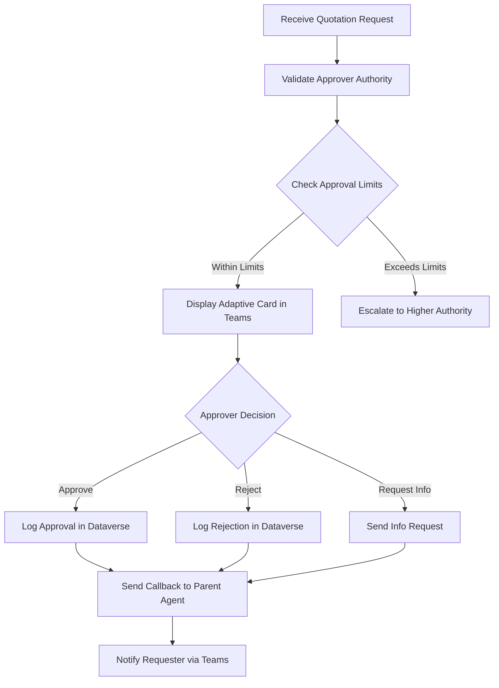

# Hardware Quotation Approval Bot for Microsoft Teams

## Description

This is a Microsoft Teams bot built with Copilot Studio that automates the hardware quotation approval workflow. The bot acts as an approval agent that receives quotation requests from a parent Copilot Studio agent, presents the details to authorized approvers through rich adaptive cards in Teams, and handles the complete approval lifecycle including decision logging, notifications, and callbacks.

Key capabilities:
- **Automated Approval Workflow**: Streamlines hardware purchase approvals by presenting quotations directly in Teams
- **Role-Based Authorization**: Enforces approval limits based on Azure AD roles and organizational hierarchy
- **Comprehensive Audit Trail**: Logs all approval decisions, timestamps, and approver details in Dataverse
- **Integration Ready**: Designed to work seamlessly with other Copilot Studio agents via webhook triggers
- **Resilient Architecture**: Includes retry mechanisms and dead letter queues for failed callbacks

## How It Works

### 1. Request Initiation
A parent Copilot Studio agent triggers this bot by sending a hardware quotation request via webhook. The payload includes:
- Quotation details (items, quantities, prices)
- Vendor information
- Requester details
- Business justification
- Callback URL for status updates

### 2. Approval Workflow
The bot follows this sequence:



### 3. Integration Points

**Incoming Webhook**
- Receives POST requests at `/api/quotation-approval`
- Validates request schema and authentication
- Triggers Copilot Studio conversation flow

**Callback Mechanism**
- Sends status updates to parent agent's callback URL
- Implements exponential backoff retry (3 attempts)
- Failed callbacks go to dead letter queue

**Teams Integration**
- Sends rich adaptive cards to approver's Teams channel
- Cards display quotation details, totals, and action buttons
- Approver clicks directly in Teams to make decisions

### 4. Data Flow

1. **Request Reception**: Webhook endpoint receives JSON payload
2. **Role Validation**: Power Automate flow checks approver's role against Azure AD
3. **Limit Check**: Compares quotation total against role-based limits in Dataverse
4. **User Interaction**: Adaptive card rendered in Teams with approve/reject/info buttons
5. **Decision Processing**: User action triggers corresponding Copilot Studio topic
6. **Data Persistence**: Power Automate flow writes decision to Dataverse
7. **Callback Execution**: Separate flow sends HTTPS POST to callback URL
8. **Notification**: Final flow sends confirmation to original requester

### 5. Security & Compliance

- **Authentication**: OAuth 2.0 with Azure AD integration
- **Authorization**: Role-based access control (RBAC) for approval limits
- **Audit Trail**: Every decision logged with timestamp, approver ID, and justification
- **Data Encryption**: TLS for all external communications
- **Compliance**: Supports regulatory requirements for purchase approval documentation

## Project Structure

```
hardware-quotation-approval-bot/
├── copilot-studio/
│   ├── topics/              # Copilot Studio conversation topics
│   ├── adaptive-cards/      # Adaptive card templates
│   └── power-automate/      # Power Automate flow definitions
├── dataverse/               # Dataverse schema and configurations
├── authentication/          # Authentication and security settings
├── integration/             # Integration endpoints and webhooks
├── deployment/              # Deployment scripts and manifests
└── docs/                    # Additional documentation
```

## Features

- Receives hardware quotation details from parent Copilot Studio agent
- Displays quotation information in rich adaptive cards
- Provides approval/rejection/more-info actions
- Logs all decisions to Dataverse
- Sends callbacks to parent agent
- Supports role-based approval limits
- Includes audit trail and compliance features

## Technical Architecture

### Component Details

1. **Copilot Studio Topics** (`/copilot-studio/topics/`)
   - `main-approval-flow.yaml`: Entry point that receives webhook triggers
   - `handle-approval.yaml`: Processes approval decisions and triggers logging
   - `handle-rejection.yaml`: Handles rejection flow with reason capture
   - `request-more-info.yaml`: Manages additional information requests

2. **Power Automate Flows** (`/copilot-studio/power-automate/`)
   - `check-approval-limits.json`: Validates approver authority against role-based limits
   - `log-approval-decision.json`: Persists all decisions to Dataverse with full context
   - `send-callback-notification.json`: Handles callbacks with retry logic and dead letter queue
   - `send-teams-notification.json`: Delivers rich adaptive cards to approvers

3. **Dataverse Tables** (`/dataverse/schema/`)
   - **hardware_quotation_approvals**: Main table storing approval records
     - Fields: request_id, approver_id, decision, decision_date, justification, quotation_total
   - **approval_limits**: Configuration table for role-based limits
     - Fields: role_name, max_approval_amount, escalation_role

4. **Adaptive Cards** (`/copilot-studio/adaptive-cards/`)
   - `quotation-approval-card.json`: Main approval interface with item details
   - `decision-confirmation-card.json`: Success notification after decision
   - `escalation-notification-card.json`: Alert when escalation required

### Environment Variables

Configure these in your Power Platform environment:
- `WEBHOOK_ENDPOINT_URL`: Public URL for receiving quotation requests
- `TEAMS_CHANNEL_ID`: Target Teams channel for notifications
- `CALLBACK_RETRY_ATTEMPTS`: Number of callback retries (default: 3)
- `CALLBACK_RETRY_DELAY`: Initial retry delay in seconds (default: 5)
- `DEAD_LETTER_QUEUE_URL`: Endpoint for failed callbacks

## Prerequisites

- Microsoft 365 license with Power Platform access
- Copilot Studio (Power Virtual Agents) license
- Teams admin access
- Power Automate license
- Dataverse environment
- Azure AD Premium for role-based access control

## Setup & Configuration

### 1. Initial Setup

```bash
# Clone the repository
git clone https://github.com/yourorg/hardware-quotation-approval-bot.git
cd hardware-quotation-approval-bot

# Install dependencies (if any)
npm install
```

### 2. Azure AD Configuration

1. Register a new app in Azure AD:
   ```bash
   az ad app create --display-name "Hardware Quotation Approval Bot" \
     --identifier-uris "api://quotation-approval-bot"
   ```

2. Configure API permissions:
   - User.Read
   - TeamworkAppSettings.ReadWrite.All
   - ChannelMessage.Send

3. Set up role assignments in `/authentication/role-mappings.json`

### 3. Deploy to Power Platform

```powershell
# Run the deployment script
.\deployment\deploy-to-copilot-studio.ps1 `
  -TenantId "<your-tenant-id>" `
  -EnvironmentId "<your-environment-id>" `
  -SolutionPath ".\copilot-studio\solution.zip"
```

### 4. Configure Dataverse

1. Import table schemas:
   ```powershell
   pac solution import --path .\dataverse\solution\dataverse-tables.zip
   ```

2. Set up security roles:
   ```powershell
   pac security role create --environment "<env-id>" `
     --role-definition-file .\dataverse\security\approval-roles.xml
   ```

### 5. Teams Deployment

1. Update Teams app manifest in `/authentication/teams-app-manifest.json`
2. Package and upload to Teams Admin Center:
   ```bash
   npm run package-teams-app
   # Upload resulting .zip file in Teams Admin Center
   ```

### 6. Configure Webhook Endpoint

1. Set up the webhook URL in Copilot Studio:
   - Go to Settings > Extensions > Webhook
   - Add endpoint: `https://your-domain.com/api/quotation-approval`
   - Configure authentication headers

2. Test the webhook:
   ```bash
   curl -X POST https://your-domain.com/api/quotation-approval \
     -H "Content-Type: application/json" \
     -H "Authorization: Bearer <token>" \
     -d @./docs/test-payload.json
   ```

## Testing

Run the test suite:
```bash
# Unit tests for Power Automate flows
npm run test:flows

# Integration tests
npm run test:integration

# End-to-end tests
npm run test:e2e
```

## Monitoring & Troubleshooting

- Check Power Automate run history for flow execution details
- Monitor Copilot Studio analytics for conversation insights
- Review Dataverse audit logs for approval tracking
- Use Application Insights for webhook monitoring

See `/docs/deployment-guide.md` for detailed instructions and `/docs/troubleshooting.md` for common issues.