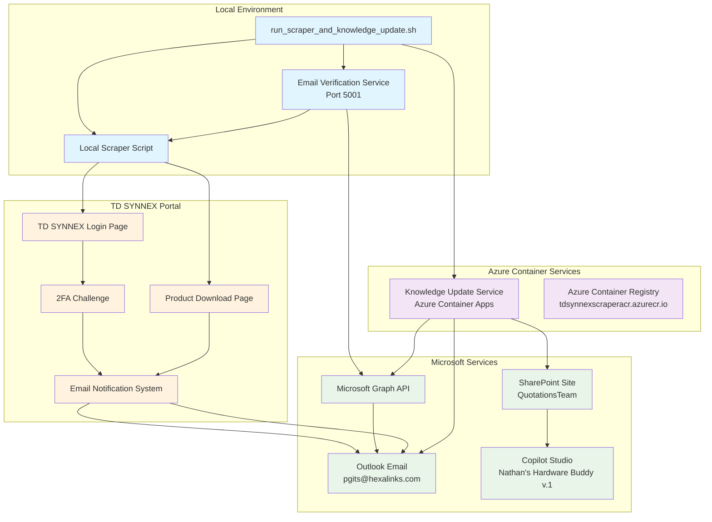
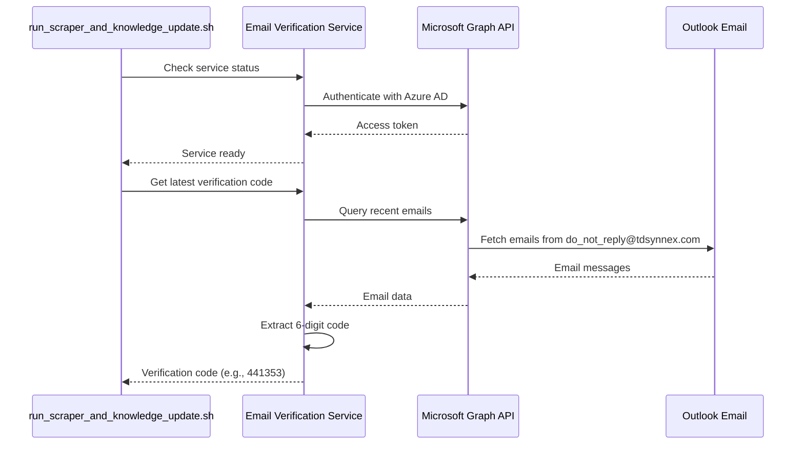
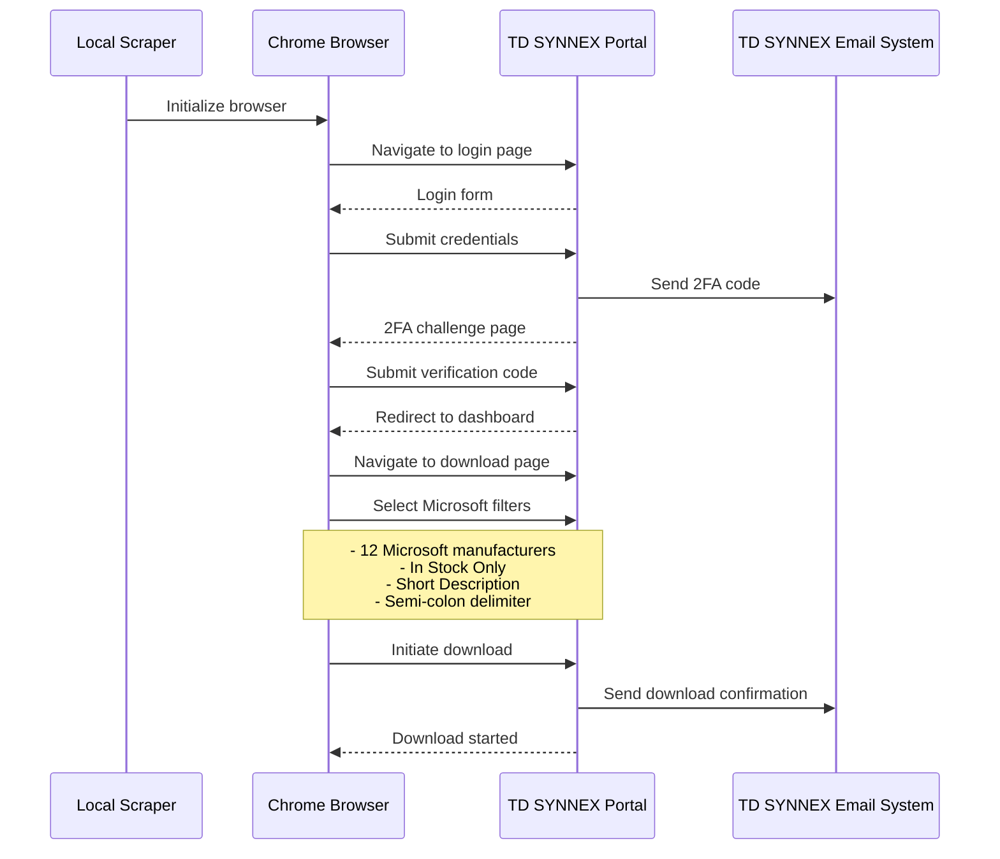
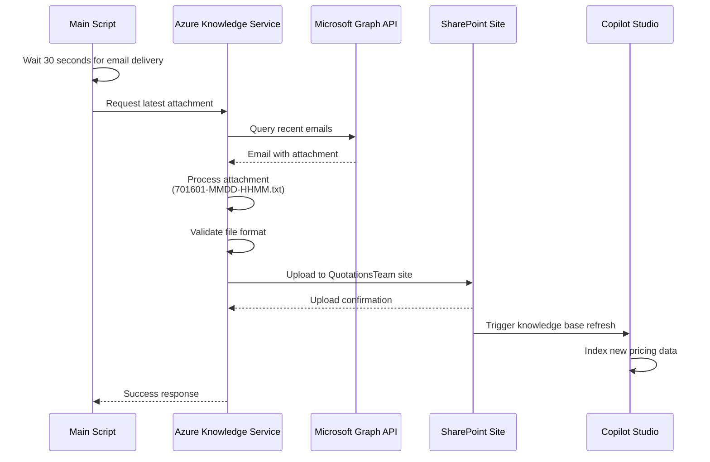

# TD SYNNEX Scraper & Knowledge Update Workflow

This document explains the complete automated workflow for scraping TD SYNNEX Microsoft product data and updating the Copilot Studio knowledge base.

## System Overview

The TD SYNNEX scraper ecosystem automates the process of:
1. Logging into TD SYNNEX portal with 2FA authentication
2. Downloading Microsoft product inventory data
3. Processing email confirmations and attachments
4. Updating Microsoft Copilot Studio knowledge base via SharePoint

## Architecture Flow Diagram



## Detailed Workflow Steps

### Phase 1: Setup & Authentication (0-30 seconds)



### Phase 2: TD SYNNEX Scraping (30-120 seconds)



### Phase 3: Email Processing & Knowledge Update (30-60 seconds)



## Service Components

### 1. Email Verification Service
- **Location**: `./email-verification-service/`
- **Port**: 5001
- **Purpose**: Retrieves 2FA codes from Outlook emails
- **Technology**: Python Flask + Microsoft Graph API

**Key Endpoints**:
- `GET /health` - Service health check
- `GET /verification-code` - Get latest 2FA code
- `GET /status` - Service status

### 2. Local Production Scraper
- **File**: `production_scraper_with_2fa.py`
- **Purpose**: Automates TD SYNNEX portal login and download
- **Technology**: Python + Selenium WebDriver

**Key Features**:
- Chrome browser automation
- VWO bypass for page visibility
- Microsoft product filtering
- Download process automation

### 3. Knowledge Update Service
- **Location**: Azure Container Apps
- **URL**: `https://td-synnex-knowledge-update.calmglacier-2bbf2a81.eastus.azurecontainerapps.io`
- **Purpose**: Processes email attachments and updates SharePoint
- **Technology**: Python Flask + Azure APIs

**Key Endpoints**:
- `GET /health` - Service health check
- `GET /latest-attachment` - Get latest TD SYNNEX file
- `GET /sharepoint-files` - List SharePoint files
- `POST /update-knowledge-base` - Manual knowledge update

### 4. Main Orchestration Script
- **File**: `run_scraper_and_knowledge_update.sh`
- **Purpose**: Orchestrates the complete workflow
- **Features**: Status monitoring, error handling, progress reporting

## Data Flow

### File Naming Convention
TD SYNNEX price files follow the pattern:
```
{customer_number}-{MM}{DD}-{HHMM}.txt
Example: 701601-0729-0728.txt
```

### File Processing Pipeline
```
TD SYNNEX Email → Email Attachment → Knowledge Service → SharePoint → Copilot Studio
     │                   │                  │              │            │
     │                   │                  │              │            └─ Knowledge Base Update
     │                   │                  │              └─ File Storage & Versioning  
     │                   │                  └─ Content Validation & Processing
     │                   └─ Automatic Extraction (89KB typical)
     └─ Notification System (do_not_reply@tdsynnex.com)
```

## Configuration

### Environment Variables
The system requires these key environment variables:

**Email Service** (`.env`):
```bash
AZURE_TENANT_ID=your-tenant-id
AZURE_CLIENT_ID=your-client-id  
AZURE_CLIENT_SECRET=your-client-secret
OUTLOOK_USER_EMAIL=pgits@hexalinks.com
```

**Knowledge Service** (Azure Container Apps):
```bash
AZURE_TENANT_ID=your-tenant-id
AZURE_CLIENT_ID=your-client-id
AZURE_CLIENT_SECRET=your-client-secret
OUTLOOK_USER_EMAIL=pgits@hexalinks.com
CUSTOMER_NUMBER=701601
DATAVERSE_URL=your-dataverse-url
```

### Azure Resources
- **Resource Group**: `td-synnex-scraper-rg`
- **Container Registry**: `tdsynnexscraperacr.azurecr.io`
- **Container App**: `td-synnex-knowledge-update`
- **SharePoint Site**: `https://hexalinks.sharepoint.com/sites/QuotationsTeam`

## Execution

### Manual Execution
```bash
# Start the complete workflow
./run_scraper_and_knowledge_update.sh

# With custom email delivery wait time
./run_scraper_and_knowledge_update.sh --wait 45
```

### Automated Scheduling
The system can be scheduled to run twice daily:
- **Morning**: 10:00 AM EST
- **Evening**: 5:55 PM EST

## Monitoring & Troubleshooting

### Health Checks
```bash
# Email service health
curl http://localhost:5001/health

# Knowledge service health  
curl https://td-synnex-knowledge-update.calmglacier-2bbf2a81.eastus.azurecontainerapps.io/health

# SharePoint file listing
curl https://td-synnex-knowledge-update.calmglacier-2bbf2a81.eastus.azurecontainerapps.io/sharepoint-files
```

### Common Issues

1. **Email Service Not Running**
   - Solution: `./email-verification-service/start_email_service.sh`

2. **2FA Code Not Found**
   - Check email delivery timing
   - Verify TD SYNNEX account status
   - Review email filter settings

3. **Scraper Login Failures**
   - Verify TD SYNNEX credentials
   - Check for CAPTCHA challenges
   - Review VWO bypass functionality

4. **Knowledge Update Failures**
   - Check Azure AD app permissions
   - Verify SharePoint site access
   - Review container app logs

### Logs & Debugging
```bash
# Email service logs
tail -f ./email-verification-service/service.log

# Azure container logs
az containerapp logs show --name "td-synnex-knowledge-update" --resource-group "td-synnex-scraper-rg" --tail 20

# Local scraper debugging
export LOG_LEVEL=DEBUG
python3 production_scraper_with_2fa.py --verification-code 123456
```

## Success Metrics

A successful workflow execution includes:
- ✅ Email service authentication
- ✅ 2FA code retrieval 
- ✅ Successful TD SYNNEX login
- ✅ Microsoft product filtering
- ✅ Download process completion
- ✅ Email attachment processing
- ✅ SharePoint file upload
- ✅ Copilot Studio knowledge update

### Example Success Output
```
🚀 TD SYNNEX Scraper + Knowledge Update Automation
============================================================
✅ Email verification service is running
✅ Found verification code: 441353
✅ Local scraper completed successfully
⏳ Waiting 30 seconds for TD SYNNEX email delivery...
✅ Knowledge updater completed successfully!
✅ Processed file: 701601-0729-0728.txt
✅ File size: 89163 bytes
✅ File uploaded to SharePoint and ready for Copilot Studio
🎉 Complete workflow executed successfully!
```

## Integration Points

### Microsoft Copilot Studio
- **Agent Name**: "Nathan's Hardware Buddy v.1"
- **Knowledge Source**: SharePoint QuotationsTeam site
- **Update Frequency**: On-demand via workflow execution
- **Data Format**: Semi-colon delimited text files

### SharePoint Integration
- **Site**: QuotationsTeam
- **Library**: Shared Documents
- **Folder**: Quotations-Team-Channel
- **Access**: Managed via Azure AD app registration

## Security Considerations

1. **Credential Management**
   - Azure AD app registration with minimal permissions
   - Environment variables for sensitive data
   - No hardcoded credentials in scripts

2. **Network Security**
   - HTTPS-only communication
   - Azure Container Apps with external ingress
   - SharePoint site access controls

3. **Data Protection**
   - Email processing with minimal retention
   - Automated file cleanup processes
   - Audit trails in Azure logs

## Maintenance

### Regular Tasks
- **Weekly**: Review execution logs and success rates
- **Monthly**: Update dependencies and container images
- **Quarterly**: Review Azure AD app permissions and certificates
- **As Needed**: Update TD SYNNEX selectors if portal changes

### Updates & Deployments
```bash
# Update knowledge service container
cd knowledge-update
./deploy-azure.sh all

# Update local components
git pull origin main
pip install -r requirements.txt
```

---

*This workflow documentation is maintained as part of the TD SYNNEX scraper automation system for Microsoft Copilot Studio integration.*