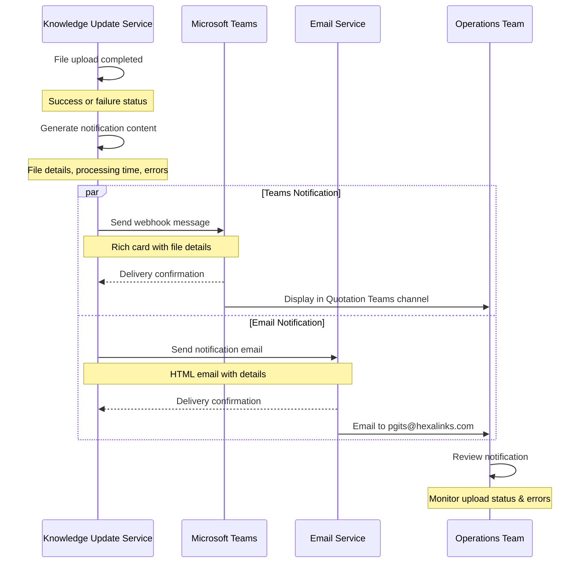

# TD SYNNEX Knowledge Update Service - Architecture Flow

## Overview

The TD SYNNEX Knowledge Update Service is an automated Azure-hosted system that extracts price file attachments from TD SYNNEX emails and uploads them to SharePoint for Copilot Studio integration. This service ensures the latest pricing information is always available to the AI-powered quotation system.

## System Architecture

```mermaid
graph TB
    subgraph "Email Source"
        A[TD SYNNEX Email Server]
        B[do_not_reply@tdsynnex.com]
        C[Price File Attachments<br/>701601-MMDD-XXXX.txt]
    end
    
    subgraph "Microsoft 365 Environment"
        D[Outlook Mailbox<br/>Email Storage]
        E[Microsoft Graph API<br/>Email Access]
    end
    
    subgraph "Azure Container Apps"
        F[Knowledge Update Service<br/>Flask REST API]
        G[Email Attachment Client<br/>Graph API Integration]
        H[File Processor<br/>Content Validation]
        I[SharePoint Uploader<br/>Graph API Integration]
        N[Notification Service<br/>Teams & Email Alerts]
    end
    
    subgraph "SharePoint Online"
        J[Quotations Team Site<br/>Document Library]
        K[Processed Price Files<br/>701601-MMDD-XXXX-timestamp.txt]
    end
    
    subgraph "Copilot Studio"
        L[Knowledge Base<br/>AI Document Processing]
        M[Quotation Bot<br/>Price Lookup & Analysis]
    end
    
    subgraph "Notification Channels"
        O[Microsoft Teams<br/>Quotation Teams Channel]
        P[Email Notifications<br/>pgits@hexalinks.com]
    end
    
    A --> B
    B --> C
    C --> D
    D --> E
    E --> G
    G --> F
    F --> H
    H --> I
    I --> J
    I --> N
    N --> O
    N --> P
    J --> K
    K --> L
    L --> M
    
    style F fill:#e1f5fe
    style G fill:#f3e5f5
    style H fill:#fff3e0
    style I fill:#e8f5e8
    style N fill:#fff9c4
    style O fill:#e3f2fd
    style P fill:#f1f8e9
```

## Detailed Component Flow

### 1. Email Processing Pipeline


### 2. SharePoint Integration Flow


### 3. Notification Flow



## API Endpoints & Functionality

### Core Service Endpoints

| Endpoint | Method | Description | Key Parameters |
|----------|--------|-------------|----------------|
| `/health` | GET | Container health check | - |
| `/latest-attachment` | GET | Get latest TD SYNNEX file | `ignore_time_window`, `download`, `upload_sharepoint` |
| `/upload-to-sharepoint` | POST | Upload file to SharePoint | `filename`, `overwrite`, `cleanup_old` |
| `/sharepoint-files` | GET | List existing files | `pattern` |
| `/attachment-history` | GET | Email attachment history | `days`, `limit` |
| `/test-notifications` | POST | Test notification system | - |

### Workflow Automation


## File Processing Logic

### TD SYNNEX File Pattern Recognition

The service identifies TD SYNNEX price files using these criteria:

1. **Sender Pattern**: `do_not_reply@tdsynnex.com`
2. **Filename Pattern**: `^\d{6}-\d{2}-\d{2}-\d{4}\.txt$`
   - Customer Number: `701601`
   - Date Format: `MM-DD` (month-day)
   - Sequence: `XXXX` (4-digit identifier)
   - Extension: `.txt`

### File Processing Steps


## Azure Deployment Architecture

### Container Configuration

```yaml
Azure Container Apps Configuration:
  Resource Group: td-synnex-scraper-rg
  Service Name: td-synnex-knowledge-update
  Registry: tdsynnexscraperacr.azurecr.io
  
  Compute:
    CPU: 1.0 cores
    Memory: 2Gi
    Min Replicas: 1
    Max Replicas: 3
  
  Network:
    Ingress: External
    Target Port: 5000
    Health Check: /health
  
  Authentication:
    Azure AD App Registration
    Client Credentials Flow
    Scopes: https://graph.microsoft.com/.default
```

### Environment Variables

| Variable | Description | Example |
|----------|-------------|---------|
| `AZURE_TENANT_ID` | Azure AD tenant ID | `12345678-1234-1234-1234-123456789012` |
| `AZURE_CLIENT_ID` | App registration client ID | `87654321-4321-4321-4321-210987654321` |
| `AZURE_CLIENT_SECRET` | App registration secret | `xxxxx~xxxxxxxxxxxxxxxxxxxxxxxxxx` |
| `OUTLOOK_USER_EMAIL` | Target mailbox email | `quotations@company.com` |
| `CUSTOMER_NUMBER` | TD SYNNEX customer number | `701601` |
| `SHAREPOINT_SITE_URL` | SharePoint site URL | `https://company.sharepoint.com/sites/Team` |

## Integration Points

### 1. Microsoft Graph API Integration

- **Email Access**: Uses delegated permissions to access Outlook mailbox
- **SharePoint Access**: Leverages application permissions for file operations
- **Authentication**: Azure AD client credentials flow with automatic token refresh

### 2. SharePoint Online Integration

- **Document Library**: Stores processed files in structured folder hierarchy
- **File Naming**: Generates unique timestamps to prevent conflicts
- **Cleanup**: Automated removal of old files (keeps latest 5 by default)

### 3. Copilot Studio Integration

- **Knowledge Base Sync**: SharePoint changes automatically sync to Copilot Studio
- **AI Processing**: Copilot Studio indexes and processes pricing data
- **Query Interface**: Enables natural language queries about pricing information

## Security & Compliance

### Authentication & Authorization


### Data Protection

- **In-Transit Encryption**: All API calls use HTTPS/TLS 1.2+
- **At-Rest Encryption**: SharePoint Online provides enterprise-grade encryption
- **Access Logging**: Comprehensive audit trail for all file operations
- **Token Management**: Automatic token refresh with secure storage

## Monitoring & Operations

### Health Monitoring

- **Container Health**: `/health` endpoint for Azure Container Apps probes
- **Dependency Checks**: Validates connections to Graph API and SharePoint
- **Performance Metrics**: Response times, success rates, error tracking

### Operational Procedures

1. **Manual Trigger**: API calls to process latest attachments
2. **Scheduled Processing**: Can be integrated with Azure Logic Apps or Power Automate
3. **Error Handling**: Comprehensive error reporting and retry mechanisms
4. **Maintenance**: Automated cleanup of old files and audit logs

## Future Enhancements

### Planned Improvements

- **Real-time Processing**: Webhook-based email notifications for immediate processing
- **Multi-Vendor Support**: Extend to other supplier email formats
- **Advanced Analytics**: Pricing trend analysis and alerting
- **Integration APIs**: Direct connection to ERP/CRM systems

---

*This document describes the TD SYNNEX Knowledge Update Service architecture as deployed in Azure Container Apps. The service provides automated email attachment processing with SharePoint integration for Copilot Studio knowledge base updates.*